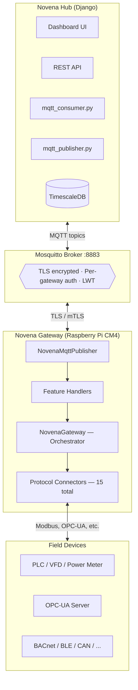

# Novena Gateway — Architecture & Project Guide

## What Is Novena Gateway?

**Novena Gateway** is a Python-based IoT gateway designed to run on a Raspberry Pi Compute Module 4 (CM4). It connects to industrial field equipment — PLCs, VFDs, power meters, sensors — via protocol connectors (Modbus, OPC-UA, BACnet, etc.) and streams data to **Novena Hub** (a Django web platform) over MQTT. The cloud provides dashboards, alerts, and remote control.

Customers buy a Novena Gateway unit, install it at their site, connect it to their equipment, and get cloud-based remote monitoring and control through their browser.

**Capabilities at a glance:**

- Read data from 15 industrial protocols (Modbus TCP/RTU, OPC-UA, BACnet, BLE, CAN, SNMP, and more)
- Write to field devices from the cloud (e.g., set motor speed, toggle coils)
- Encrypted MQTT communication (TLS / mTLS) with per-gateway authentication
- Remote config push with hot-reload — no SSH required
- Remote logging, RPC commands (ping, reboot, restart connectors, etc.)
- Automatic crash recovery via systemd with watchdog monitoring
- Rotating local log files to prevent disk exhaustion
- Config validation on startup with clear error messages

---

## System Overview

The system has three layers connected over MQTT:



### MQTT Topics

| Direction | Topic | Purpose |
|-----------|-------|---------|
| Edge → Cloud | `v1/gateway/telemetry` | Sensor data from field devices |
| Edge → Cloud | `v1/gateway/logs` | Gateway log entries |
| Edge → Cloud | `v1/gateway/attributes` | Status heartbeat (IP, uptime, firmware, devices) |
| Edge → Cloud | `v1/gateway/rpc/response` | RPC command results |
| Cloud → Edge | `v1/gateway/{sn}/config` | Remote config push |
| Cloud → Edge | `v1/gateway/{sn}/rpc/request` | RPC commands (ping, reboot, write_device, etc.) |
| Cloud → Edge | `v1/gateway/{sn}/attributes/request` | Attribute push from cloud |

### Edge Gateway Components

| Component | Role |
|-----------|------|
| **NovenaMqttPublisher** | Bidirectional paho-mqtt v2.x client. Handles TLS (one-way / mTLS), LWT, publish, subscribe, auto-reconnect. |
| **NovenaGateway** | Core orchestrator. Config validation on startup, `sd_notify` watchdog integration, wires all handlers and connectors. |
| **PayloadFormatter** | Converts `ConvertedData` from connectors into the Novena Hub JSON schema. |
| **RemoteLogHandler** | Attaches to Python root logger. Buffers in a deque (500 max), flushes every 5 s in batches of 20. |
| **AttributeSyncHandler** | Publishes heartbeat every 60 s (IP, uptime, firmware, devices, status). Handles inbound attribute push. |
| **RemoteConfigHandler** | Receives config from cloud, validates, backs up, writes atomically, hot-reloads connectors, sends ACK. |
| **RpcHandler** | Dispatches 10 commands: `ping`, `get_config`, `get_status`, `set_log_level`, `restart_connector`, `restart_all`, `reboot`, `get_devices`, `write_device`, `read_device`. |
| **Protocol Connectors (15)** | Modbus TCP/RTU, OPC-UA, MQTT bridge, BACnet, BLE, CAN, SNMP, REST, Socket, FTP, Request, KNX, OCPP, ODBC, XMPP. Unmodified from ThingsBoard Gateway. |

---

## Startup Sequence

Entry point: `python -m novena_gateway.main --config config.json`

### Phase 0 — Entry point (`main.py`)

1. Parse CLI args (`--config`, `--log-level`)
2. Load the `"logging"` block from `config.json`
3. Call `setup_logging()`:
   - **StreamHandler** to stdout (always active)
   - **RotatingFileHandler** to `/opt/novena-gateway/logs/` (if configured) — 5 MB per file, 5 backups = 25 MB total
4. Create `NovenaGateway(config_path)`

### Phase 1 — Initialization (`NovenaGateway.__init__`)

1. **Load config** — `json.load(config.json)`
2. **Validate config** — `_validate_config()` checks required keys (`gateway.serial_number`, `mqtt.host`, `mqtt.port`, `connectors`) and TLS cross-validation. On failure: prints a clear `CONFIG ERROR` message and calls `sys.exit(1)`.
3. **Create MQTT client** — `NovenaMqttPublisher(config["mqtt"], serial_number)`
   - `_configure_tls()` — sets up one-way or mutual TLS based on `tls.mode`
   - `_configure_lwt()` — registers LWT with "offline" status payload
4. **Create PayloadFormatter** — converts `ConvertedData` to Novena Hub JSON
5. **Create feature handlers:**
   - `RemoteLogHandler` (publisher, serial_number, feature config)
   - `AttributeSyncHandler` (gateway, publisher, serial_number, feature config)
   - `RemoteConfigHandler` (gateway, publisher, serial_number, config_path, feature config)
   - `RpcHandler` (gateway, publisher, serial_number, config_path, feature config)

### Phase 2 — Run (`NovenaGateway.run`)

1. **Connect MQTT** — TLS handshake with Mosquitto on port 8883
2. **Start RemoteLogHandler** — starts flush thread (every 5 s) and attaches to Python root logger
3. **Start AttributeSyncHandler** — subscribes to inbound attribute topic, publishes initial `"status": "online"`, starts heartbeat thread (every 60 s)
4. **Start RemoteConfigHandler** — subscribes to config topic
5. **Start RpcHandler** — subscribes to RPC request topic
6. **Start connectors** — for each entry in `config["connectors"]`: dynamically loads the class via `TBModuleLoader`, creates the instance, calls `connector.open()` to begin polling
7. **Start DataProcessor thread** — daemon thread that drains the `SimpleQueue`, formats payloads, and publishes via MQTT
8. **Notify systemd** — `sd_notify("READY=1")` tells systemd startup is complete
9. **Main loop** — `while not stopped`: sleep 1 s, ping `sd_notify("WATCHDOG=1")` every 60 s

---

## The 5 Data Flows

### Flow 1 — Telemetry (edge → cloud)

> Monitoring data from field devices to the cloud dashboard.

1. **ModbusConnector** polls the field device every N seconds (configurable via `pollPeriod`)
2. Connector produces `ConvertedData("Power Meter 1", telemetry=[("active_power", 450.2)])`
3. Connector calls `gateway.send_to_storage()` which puts data on a `SimpleQueue`
4. **DataProcessor** thread drains the queue, calls `PayloadFormatter.format()` to produce:
   ```json
   {"serial_number": "NF-EDGE-001", "ts": 1714000000000,
    "values": {"device_name": "Power Meter 1", "active_power": 450.2}}
   ```
5. `NovenaMqttPublisher.publish()` sends it via **QoS 1** to `v1/gateway/telemetry`
6. **Cloud**: `mqtt_consumer` writes to TimescaleDB, dashboard renders the chart

### Flow 2 — Device Control (cloud → field device)

> Write to physical equipment from the cloud dashboard (e.g., set motor speed).

1. Cloud user clicks "Set VFD Motor 1 speed to 1500 RPM" on the dashboard
2. Django sends `POST /api/gateways/1/devices/3/command/` which publishes to `v1/gateway/NF-EDGE-001/rpc/request`:
   ```json
   {"request_id": "uuid", "method": "write_device",
    "params": {"device_name": "VFD Motor 1", "functionCode": 6,
               "address": 2, "value": 1500, "type": "16uint"}}
   ```
3. `NovenaMqttPublisher._on_message()` routes to `RpcHandler._on_rpc_request()`
4. RpcHandler dispatches `"write_device"` to `_cmd_write_device(params)`
5. `_find_connector_for_device("VFD Motor 1")` looks up the device registry to find the owning `ModbusConnector`
6. `connector.server_side_rpc_handler(content)` executes the Modbus FC6 write
7. Physical VFD motor speed register is updated — motor ramps up
8. RpcHandler sends response to `v1/gateway/rpc/response`:
   ```json
   {"status": "success", "result": {"operation": "write", ...}}
   ```
9. **Cloud**: `RpcCommand.status = "success"` — dashboard shows the result

### Flow 3 — Remote Config (cloud → edge, hot-reload)

> Push config updates to the gateway without SSH — connectors restart automatically.

1. Cloud admin updates the connector config in the dashboard
2. Django publishes to `v1/gateway/NF-EDGE-001/config`:
   ```json
   {"request_id": "uuid", "action": "full_update", "config": {...}}
   ```
3. `RemoteConfigHandler._on_config_update()` receives the message
4. **Validate** — checks that `"gateway"` and `"mqtt"` keys are present
5. **Backup** — copies current config to `config_backups/config_backup_{ts}.json` (keeps last 10)
6. **Write** — writes new `config.json` atomically (`.tmp` file then `os.replace`)
7. **Hot-reload** — stops all connectors, updates `gateway._config`, restarts connectors
8. **ACK** — publishes to `v1/gateway/attributes`:
   ```json
   {"config_update_status": "success", "config_update_request_id": "uuid"}
   ```
9. **Cloud**: `GatewayConfig.status = "success"`

### Flow 4 — Remote Logging (edge → cloud)

> Gateway logs appear in the cloud dashboard in near real-time.

1. Any Python logger in the gateway emits a record (e.g., `log.warning("Timeout polling Power Meter 1")`)
2. `RemoteLogHandler.emit()` (installed on root logger) receives it
3. **Skip** if level < `min_level` (default `INFO`) or if the logger is `novena_gateway.mqtt_publisher` (infinite loop guard)
4. **Buffer** — appends to a `deque` (max 500 entries)
5. **Flush thread** (every 5 s) batches up to 20 entries and calls `NovenaMqttPublisher.publish_logs()`
6. Published to `v1/gateway/logs`:
   ```json
   {"logs": [{"ts": ..., "level": "WARNING", "message": "Timeout polling Power Meter 1"}]}
   ```
7. **Cloud**: `GatewayLog.objects.bulk_create()` — logs appear in the dashboard log viewer

### Flow 5 — Attribute Heartbeat (edge ↔ cloud)

> The gateway tells the cloud it's alive, and the cloud can push attributes back.

**Outbound heartbeat (every 60 s):**

1. `AttributeSyncHandler` heartbeat thread collects: IP address, uptime, firmware version, connected devices, status
2. Publishes to `v1/gateway/attributes`
3. **Cloud** updates the `Gateway` model fields (`ip_address`, `uptime_seconds`, `status`, etc.)

**Graceful shutdown:**

- On `gateway.stop()`: publishes `{"status": "offline"}` before disconnecting

**Unexpected crash / power loss:**

- The broker auto-publishes the LWT message `{"status": "offline"}` after ~90 s (keepalive × 1.5) — no polling required

**Inbound attribute push:**

- Cloud sends to `v1/gateway/NF-EDGE-001/attributes/request`
- `AttributeSyncHandler._on_attribute_push()` stores the data in `_cloud_attributes` and sends an ACK

---

## Security Model

### TLS Encryption

All MQTT traffic between the gateway and broker is encrypted over TLS (port 8883). The TLS mode is configured in `config.json`:

| Mode | Config | What it does | Who uses it |
|------|--------|-------------|-------------|
| **One-way** | `"mode": "one-way"` | Gateway verifies broker's server cert via CA cert | All customers (default) |
| **Mutual (mTLS)** | `"mode": "mutual"` | Both sides verify each other — gateway also presents a client cert | Enterprise customers (paid feature) |
| **Disabled** | No `tls` block | No encryption (dev/local only — never in production) | Local development |

```json
"tls": {
  "mode": "one-way",
  "ca_certs": "/opt/novena-gateway/certs/ca.crt",
  "certfile": "/opt/novena-gateway/certs/client.crt",
  "keyfile":  "/opt/novena-gateway/certs/client.key"
}
```

- `ca_certs` is required for both modes — the gateway always verifies the broker
- `certfile` and `keyfile` are only required for `"mutual"` mode
- File paths are validated on startup — missing files produce a clear error

### MQTT Authentication

Each gateway authenticates with a unique username and password:

- **Username** = gateway serial number (e.g., `NF-EDGE-001`)
- **Password** = random token generated during provisioning
- The Mosquitto broker enforces ACLs — each gateway can only read/write its own topics

### Last Will and Testament (LWT)

Before connecting, the MQTT client registers a "last will" message with the broker:

```json
{"serial_number": "NF-EDGE-001", "ts": ..., "attributes": {"status": "offline"}}
```

If the gateway crashes, loses power, or the network drops, the broker automatically publishes this message after `keepalive × 1.5` seconds (~90s). The cloud receives it on `v1/gateway/attributes` and marks the gateway offline — no polling required.

### Config Validation

On startup, `_validate_config()` checks:

- **Required keys:** `gateway.serial_number`, `mqtt.host`, `mqtt.port`, `connectors` (list)
- **TLS cross-validation:** if `mode == "mutual"`, verifies `certfile` and `keyfile` are present and exist on disk
- **Failure mode:** prints a human-readable error and exits with code 1 — no cryptic stack traces

```
============================================================
  CONFIG ERROR — Novena Gateway cannot start
============================================================
  ✗ Missing or invalid: mqtt.host
  ✗ Missing or invalid: mqtt.tls.ca_certs — file not found: /opt/novena-gateway/certs/ca.crt

  Edit /opt/novena-gateway/config.json to fix these issues.
```

---

## Reliability Features

### systemd Watchdog

The gateway runs as a `Type=notify` systemd service. On startup it sends `READY=1` to tell systemd it's fully initialized. Every 60 seconds it pings `WATCHDOG=1`. If the ping stops for 120 seconds (`WatchdogSec=120`), systemd kills and restarts the process — protecting against deadlocks and hangs.

### Auto-Restart on Crash

```ini
# novena-gateway.service
Restart=always
RestartSec=10
```

If the process exits for any reason (crash, unhandled exception, OOM kill), systemd restarts it after 10 seconds.

### Log Rotation

Local logs are written via `RotatingFileHandler`:

- **Path:** `/opt/novena-gateway/logs/novena-gateway.log`
- **Max size:** 5 MB per file
- **Backups:** 5 rotated files (25 MB total)
- Prevents the 32 GB SD card from filling up over weeks of operation

### Queue Buffering

If the MQTT broker is unreachable, telemetry messages queue in memory (up to 10,000 messages). When the connection recovers, the queue drains automatically. Connector polling is never blocked by a slow or offline broker.

### Config Backups

Before applying any remote config update, the current config is backed up to `config_backups/config_backup_{timestamp}.json`. The last 10 backups are kept. If a bad config is pushed, you can manually restore from the backup directory.

---

## Configuration Reference

The gateway is configured entirely through `config.json`. Below is the full structure followed by a key-by-key reference.

### Full config.json

```json
{
  "gateway": {
    "serial_number": "NF-EDGE-001"
  },
  "mqtt": {
    "host": "mqtt.${NOVENA_DOMAIN}",
    "port": 8883,
    "topic": "v1/gateway/telemetry",
    "username": "NF-EDGE-001",
    "password": "random-token-here",
    "qos": 1,
    "client_id": "novena-gateway-001",
    "max_queue_size": 10000,
    "reconnect_delay_min": 1,
    "reconnect_delay_max": 60,
    "tls": {
      "mode": "one-way",
      "ca_certs": "/opt/novena-gateway/certs/ca.crt",
      "certfile": "/opt/novena-gateway/certs/client.crt",
      "keyfile": "/opt/novena-gateway/certs/client.key"
    }
  },
  "logging": {
    "file": "/opt/novena-gateway/logs/novena-gateway.log",
    "max_bytes": 5242880,
    "backup_count": 5
  },
  "features": {
    "remote_logging": {
      "enabled": true,
      "min_level": "INFO",
      "batch_size": 20,
      "flush_interval_seconds": 5,
      "max_buffer_size": 500
    },
    "attribute_sync": {
      "enabled": true,
      "heartbeat_interval_seconds": 60
    },
    "remote_config": { "enabled": true },
    "rpc": { "enabled": true }
  },
  "connectors": [
    {
      "type": "modbus",
      "name": "Modbus TCP Connector",
      "config": {
        "master": {
          "slaves": [
            {
              "host": "192.168.1.100",
              "port": 502,
              "type": "tcp",
              "unitId": 1,
              "deviceName": "Power Meter 1",
              "pollPeriod": 5000,
              "timeseries": [
                {"tag": "active_power", "type": "32float", "functionCode": 3, "objectsCount": 2, "address": 3060}
              ],
              "attributes": []
            }
          ]
        }
      }
    }
  ]
}
```

### Key Reference

#### `gateway`

| Key | Type | Description |
|-----|------|-------------|
| `serial_number` | string | **Required.** Unique gateway ID. Must match the Mosquitto ACL and the cloud `Gateway` model. |

#### `mqtt`

| Key | Type | Default | Description |
|-----|------|---------|-------------|
| `host` | string | `"localhost"` | **Required.** Mosquitto broker address. |
| `port` | int | `1883` | **Required.** Use `8883` for TLS, `1883` for dev (no TLS). |
| `topic` | string | `"v1/gateway/telemetry"` | Default telemetry publish topic. |
| `username` | string | `""` | MQTT auth username — set during provisioning. |
| `password` | string | `""` | MQTT auth password — set during provisioning. |
| `qos` | int | `1` | MQTT QoS level. `1` = at-least-once delivery. |
| `client_id` | string | `"novena-gateway"` | Unique MQTT client ID. |
| `max_queue_size` | int | `10000` | In-memory message buffer when the broker is offline. |
| `reconnect_delay_min` | int | `1` | Seconds before first reconnect attempt. |
| `reconnect_delay_max` | int | `60` | Max backoff between reconnect attempts (seconds). |

#### `mqtt.tls` *(optional — omit for dev/local)*

| Key | Type | Description |
|-----|------|-------------|
| `mode` | string | `"one-way"` or `"mutual"`. Determines TLS handshake mode. |
| `ca_certs` | string | Path to CA certificate. **Required** for both modes. |
| `certfile` | string | Path to client certificate. **Required for `"mutual"` only.** |
| `keyfile` | string | Path to client private key. **Required for `"mutual"` only.** |

#### `logging` *(optional — omit to skip file logging)*

| Key | Type | Default | Description |
|-----|------|---------|-------------|
| `file` | string | — | Log file path (e.g., `/opt/novena-gateway/logs/novena-gateway.log`). |
| `max_bytes` | int | `5242880` | Max log file size before rotation (5 MB). |
| `backup_count` | int | `5` | Number of rotated backup files to keep. |

#### `features.remote_logging`

| Key | Type | Default | Description |
|-----|------|---------|-------------|
| `enabled` | bool | `true` | Enable/disable sending logs to cloud. |
| `min_level` | string | `"INFO"` | Minimum log level to send (`DEBUG`, `INFO`, `WARNING`, `ERROR`). |
| `batch_size` | int | `20` | Max log entries per MQTT message. |
| `flush_interval_seconds` | int | `5` | How often the flush thread runs (seconds). |
| `max_buffer_size` | int | `500` | Max entries held in memory before oldest are dropped. |

#### `features.attribute_sync`

| Key | Type | Default | Description |
|-----|------|---------|-------------|
| `enabled` | bool | `true` | Enable/disable attribute heartbeat. |
| `heartbeat_interval_seconds` | int | `60` | Seconds between heartbeat publishes. |

#### `features.remote_config` / `features.rpc`

| Key | Type | Default | Description |
|-----|------|---------|-------------|
| `enabled` | bool | `true` | Enable/disable the feature. |

#### `connectors[]`

| Key | Type | Description |
|-----|------|-------------|
| `type` | string | Connector type — maps to a Python class (e.g., `"modbus"`, `"opcua"`). |
| `name` | string | Human-readable name for logging. |
| `config` | object | Connector-specific configuration. See each connector's docs for schema. |

---

## Key Design Decisions

**1. Connector compatibility without modification**
`NovenaGateway` implements the same interface (`add_device`, `del_device`, `send_to_storage`, `send_rpc_reply`, `get_devices`) that all 15 ThingsBoard connectors call internally. Zero connector code was touched.

**2. One MQTT client for everything**
A single `NovenaMqttPublisher` handles both publish and subscribe. Handlers register callbacks via `publisher.subscribe(topic, fn)`. On reconnect, all subscriptions are automatically re-issued.

**3. Queue decouples connectors from MQTT**
Connectors drop `ConvertedData` onto a `SimpleQueue`. A separate `DataProcessor` thread drains it. A slow or disconnected broker never blocks Modbus polling — data queues locally until the broker recovers.

**4. Device control reuses the connector RPC path**
`write_device` / `read_device` format cloud params into the `content` dict that `server_side_rpc_handler()` already expects, then delegate entirely. The connector handles byte ordering, data type encoding, async I/O, and timeouts — and this works for OPC-UA too.

**5. Config as single source of truth**
`config.json` on disk is authoritative. Remote config updates write to disk *before* hot-reloading. If the process crashes mid-reload, the new config is already on disk so the next startup picks it up cleanly.

**6. Infinite loop prevention in logging**
`RemoteLogHandler` skips log records from `novena_gateway.mqtt_publisher`. Without this, publishing a log would emit another log, which would try to publish, recursing until stack overflow.

**7. TLS mode flag for dashboard control**
An explicit `"mode"` key in the `tls` config block (`"one-way"` / `"mutual"`) lets the cloud push mTLS upgrades via remote config — the customer can enable it from the dashboard without SSH access.

**8. Proper systemd integration via sd_notify**
Instead of a simple `Type=simple` service, the gateway uses `Type=notify` with `sdnotify`. systemd only marks the service as "started" after `READY=1`, and `WATCHDOG=1` pings every 60s prove the process is alive — not just that the PID exists.

---

## File Map

### Root files

| File | Purpose |
|------|---------|
| `config.json` | All config: gateway, MQTT, TLS, logging, features, connectors |
| `install.sh` | Raspberry Pi deployment script (creates dirs, venv, systemd service) |
| `novena-gateway.service` | systemd unit file (`Type=notify`, `WatchdogSec=120`, `Restart=always`) |
| `requirements.txt` | Python dependencies (paho-mqtt, pymodbus, sdnotify, etc.) |
| `setup.py` | Package setup (imports `__version__`) |
| `ARCHITECTURE.md` | This file |
| `NOVENA_CLOUD_SPEC.md` | Cloud-side implementation guide (Django, Mosquitto config) |
| `Blueprint.md` | Original project goals and requirements |

### `novena_gateway/` — Core package

| File | Purpose |
|------|---------|
| `__init__.py` | Package marker |
| `__version__.py` | Single source of truth: `__version__ = "0.1.0"` |
| `main.py` | Entry point: CLI args, log rotation setup, gateway init |

### `novena_gateway/gateway/` — Gateway logic

| File | Purpose |
|------|---------|
| `novena_gateway.py` | **Orchestrator**: config validation, `sd_notify`, wires all components |
| `novena_mqtt_publisher.py` | **MQTT client**: TLS (one-way / mTLS), LWT, pub/sub, auto-reconnect |
| `payload_formatter.py` | `ConvertedData` → Novena Hub JSON schema |
| `remote_log_handler.py` | **Feature**: buffered logs → cloud (deque + flush thread) |
| `attribute_sync_handler.py` | **Feature**: heartbeat + attribute push (imports `__version__`) |
| `remote_config_handler.py` | **Feature**: hot-reload config from cloud (backup + atomic write) |
| `rpc_handler.py` | **Feature**: 10 RPC commands + device control (`write_device` / `read_device`) |
| `constants.py` | Connector type → class name mapping |
| `entities/converted_data.py` | Data model produced by connectors |

### `novena_gateway/connectors/` — Protocol connectors (15 total, unmodified from ThingsBoard Gateway)

| Directory | Protocol |
|-----------|----------|
| `modbus/` | Modbus TCP/RTU — read (FC 1–4) + write (FC 5/6/15/16) |
| `opcua/` | OPC-UA read + write |
| `mqtt/` | MQTT-to-MQTT bridge |
| `bacnet/` | BACnet (building automation) |
| `ble/` | Bluetooth Low Energy |
| `can/` | CAN bus |
| `snmp/` | SNMP |
| `rest/` | REST API polling |
| `request/` | HTTP request connector |
| `socket/` | Raw TCP/UDP socket |
| `ftp/` | FTP file polling |
| `knx/` | KNX (building automation) |
| `ocpp/` | OCPP (EV charger protocol) |
| `odbc/` | ODBC database connector |
| `xmpp/` | XMPP messaging |

### `novena_gateway/tb_utility/` — Shared utilities

| File | Purpose |
|------|---------|
| `tb_loader.py` | Dynamic module loader for connectors |
| `tb_logger.py` | Local logging setup |

### `tests/` — 44 unit tests, all passing

| File | Tests |
|------|-------|
| `test_payload_formatter.py` | 5 tests |
| `test_modbus_integration.py` | 1 integration test (Modbus simulator) |
| `test_remote_log_handler.py` | 6 tests |
| `test_attribute_sync.py` | 5 tests |
| `test_rpc_handler.py` | 17 tests (incl. `write_device` / `read_device`) |
| `test_remote_config.py` | 10 tests |

---

## Deployment Quick Start

### Prerequisites

- Raspberry Pi Compute Module 4 (2GB+ RAM, 32GB+ SD card)
- Python 3.9+
- Network access to the Mosquitto broker (port 8883 outbound)
- CA certificate from Novena Hub

### Install Steps

```bash
# 1. Edit config.json — set your broker address and credentials
nano config.json
#    → Set mqtt.host to your Mosquitto broker IP/domain
#    → Set mqtt.password to the provisioned password for this gateway
#    → Set gateway.serial_number to this unit's serial

# 2. Place the CA certificate
cp /path/to/ca.crt certs/ca.crt

# 3. Run the installer (on the Raspberry Pi)
sudo bash install.sh

# 4. Check the service is running
sudo systemctl status novena-gateway
#    Should show: "Active: active (running)" with "READY=1" in the status

# 5. Verify on Novena Hub
#    → Gateway should appear as "online" in the dashboard
#    → Telemetry data should start flowing within the poll period
```

### Companion Documents

- **`NOVENA_CLOUD_SPEC.md`** — Full implementation guide for the Django cloud backend: MQTT consumer, Django models, Mosquitto TLS/ACL setup, mTLS enterprise flow, API endpoints
- **`Blueprint.md`** — Original project goals and requirements
